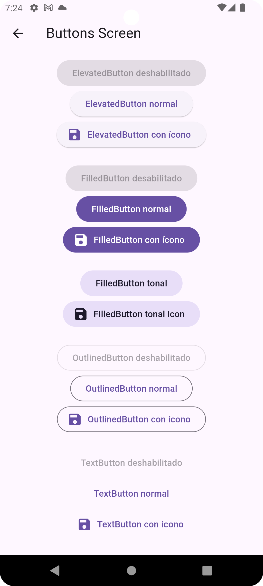

# flutter_widgets_app

Este proyecto contiene algunos widgets que nos brinda Flutter para utilizar, hay muchos que son de uso muy común para las apps construídas con Flutter.

## Cómo iniciar el proyecto

- Para ejecutar el proyecto es necesario tener un emulador de Android o iOS ejecutándose.
- Para android podría utilizar esta [guía](https://jaimetellezb.com/emulador-android-studio/).
- Para iOS se debe instalar XCode y luego ejecutar el comando ```open -a simulator```.
- Luego puede utilizar los comandos ```cmd + shift + p```para Mac o ```Ctrl + shift + p```para Windows en **Visual Studio Code** e ir a la opción de ```Flutter: Select Device``` y seleccionar el emulador que se está ejecutando.
- Ir al archivo `main.dart` y ejecutar en la parte superior derecha el ícono de play `Start Debugging`.
- Otra opción es por medio del comando `flutter run`.

## Cómo agregar una nueva categoría de widgets

- Inicialmente debemos ir a `/lib/configs/constants/constants.dart` y agregar en el enum `RouteProperties` la nueva categoría.
```dart
newCategoryScreen(
    name: 'new-category-screen',
    path: 'new-category',
    label: 'Nueva cateogoría',
)
```
- Crear la clase de Screen nueva para la categoría, ir a `/lib/screens` y crear el archivo `new_category_screen.dart`.
```dart
import 'package:flutter/material.dart';

class NewCategoryScreen extends StatelessWidget {
  const NewCategoryScreen({super.key});

  @override
  Widget build(BuildContext context) {
    return Scaffold(
      appBar: AppBar(
        title: const Text('New Category Screen'),
      ),
      body: const Placeholder(),
    );
  }
}
```
- Actualizar el archivo de barril `screens.dart` con el export de la nueva clase.

```dart
export 'new_category_screen.dart';
```

- Luego agregar la ruta en `/lib/configs/router/app_router.dart`.
```dart
GoRoute(
    name: RouteProperties.newCategoryScreen.name,
    path: RouteProperties.newCategoryScreen.path,
    builder: (context, state) => const NewCategoryScreen(),
)
```
- Por último para poder ver el botón de la nueva categoría, debemos agregarlo en /lib/configs/widget_category.dart. Además se puede agregar un ícono que lo represente.
```dart
WidgetCategory(
    title: RouteProperties.newCategoryScreen.label,
    path: RouteProperties.newCategoryScreen.path,
    icon: Icons.refresh_outlined,
)
```
- 


# Widgets

## Widgets de Material

### Actions - Botones comunes




### Crear nuevo Widget

#### Ejecutar comando `python new_widget.py example`